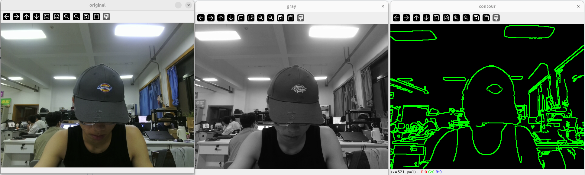
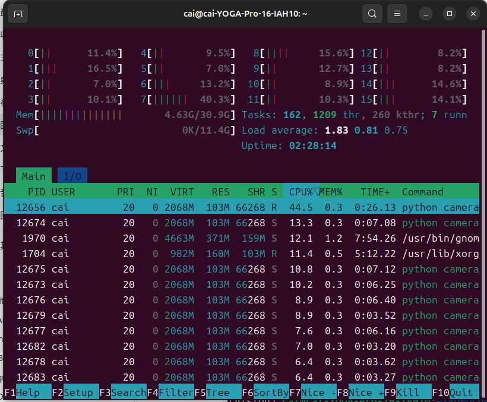

# Assignment 1

## 1. System Information
```
=====1.系统发行版=====
PRETTY_NAME="Ubuntu 24.04.4 LTS"
NAME="Ubuntu"
VERSION_ID="24.04"
VERSION="24.04.4 LTS (Noble Numbat)"
VERSION_CODENAME=noble
ID=ubuntu
ID_LIKE=debian
HOME_URL="https://www.ubuntu.com/"
SUPPORT_URL="https://help.ubuntu.com/"
BUG_REPORT_URL="https://bugs.launchpad.net/ubuntu/"
PRIVACY_POLICY_URL="https://www.ubuntu.com/legal/terms-and-policies/privacy-policy"
UBUNTU_CODENAME=noble
LOGO=ubuntu-logo

=====2.内核版本=====
6.17.0-14-generic

=====3.CPU信息=====
架构：                                   x86_64
CPU 运行模式：                           32-bit, 64-bit
Address sizes:                           46 bits physical, 48 bits virtual
字节序：                                 Little Endian
CPU:                                     16
在线 CPU 列表：                          0-15
厂商 ID：                                GenuineIntel
型号名称：                               Intel(R) Core(TM) Ultra 9 285H
CPU 系列：                               6
型号：                                   197
每个核的线程数：                         1
每个座的核数：                           16
座：                                     1
步进：                                   2
CPU(s) scaling MHz:                      28%
CPU 最大 MHz：                           5400.0000
CPU 最小 MHz：                           400.0000
BogoMIPS：                               7372.80
标记：                                   fpu vme de pse tsc msr pae mce cx8 apic sep mtrr pge mca cmov pat pse36 clflush dts acpi mmx fxsr sse sse2 ss ht tm pbe syscall nx pdpe1gb rdtscp lm constant_tsc art arch_perfmon pebs bts rep_good nopl xtopology nonstop_tsc cpuid aperfmperf tsc_known_freq pni pclmulqdq dtes64 monitor ds_cpl vmx smx est tm2 ssse3 sdbg fma cx16 xtpr pdcm pcid sse4_1 sse4_2 x2apic movbe popcnt tsc_deadline_timer aes xsave avx f16c rdrand lahf_lm abm 3dnowprefetch cpuid_fault epb ssbd ibrs ibpb stibp ibrs_enhanced tpr_shadow flexpriority ept vpid ept_ad fsgsbase tsc_adjust bmi1 avx2 smep bmi2 erms invpcid rdseed adx smap clflushopt clwb intel_pt sha_ni xsaveopt xsavec xgetbv1 xsaves split_lock_detect user_shstk avx_vnni lam wbnoinvd dtherm ida arat pln pts hwp hwp_notify hwp_act_window hwp_epp hwp_pkg_req hfi vnmi umip pku ospke waitpkg gfni vaes vpclmulqdq rdpid bus_lock_detect movdiri movdir64b fsrm md_clear serialize pconfig arch_lbr ibt flush_l1d arch_capabilities
虚拟化：                                 VT-x
L1d 缓存：                               480 KiB (12 instances)
L1i 缓存：                               768 KiB (12 instances)
L2 缓存：                                28 MiB (9 instances)
L3 缓存：                                24 MiB (1 instance)
NUMA 节点：                              1
NUMA 节点0 CPU：                         0-15
Vulnerability Gather data sampling:      Not affected
Vulnerability Ghostwrite:                Not affected
Vulnerability Indirect target selection: Not affected
Vulnerability Itlb multihit:             Not affected
Vulnerability L1tf:                      Not affected
Vulnerability Mds:                       Not affected
Vulnerability Meltdown:                  Not affected
Vulnerability Mmio stale data:           Not affected
Vulnerability Old microcode:             Not affected
Vulnerability Reg file data sampling:    Not affected
Vulnerability Retbleed:                  Not affected
Vulnerability Spec rstack overflow:      Not affected
Vulnerability Spec store bypass:         Mitigation; Speculative Store Bypass disabled via prctl
Vulnerability Spectre v1:                Mitigation; usercopy/swapgs barriers and __user pointer sanitization
Vulnerability Spectre v2:                Mitigation; Enhanced / Automatic IBRS; IBPB conditional; PBRSB-eIBRS Not affected; BHI BHI_DIS_S
Vulnerability Srbds:                     Not affected
Vulnerability Tsa:                       Not affected
Vulnerability Tsx async abort:           Not affected
Vulnerability Vmscape:                   Mitigation; IBPB before exit to userspace

=====4.显卡硬件=====
00:02.0 VGA compatible controller: Intel Corporation Arrow Lake-P [Intel Graphics] (rev 03)
01:00.0 VGA compatible controller: NVIDIA Corporation Device 2d18 (rev a1)

=====5.显卡驱动=====
00:02.0 VGA compatible controller: Intel Corporation Arrow Lake-P [Intel Graphics] (rev 03)
	Subsystem: Lenovo Device 3807
	Kernel driver in use: i915
	Kernel modules: i915, xe
--
01:00.0 VGA compatible controller: NVIDIA Corporation Device 2d18 (rev a1)
	Subsystem: Lenovo Device 3801
	Kernel modules: nvidiafb, nouveau
01:00.1 Audio device: NVIDIA Corporation Device 22eb (rev a1)

=====6.会话类型 XDG_SESSION_TYPE=====
wayland

=====7.DISPLAY=====
:0

=====8.WAYLAND_DISPLAY=====
wayland-0

=====9. NVIDIA与CUDA环境检查=====
# nvidia-smi
执行输出：No devices were found
现象说明：
本机硬件搭载NVIDIA独立显卡，但Ubuntu系统无法识别到N卡。
已关闭Secure Boot、屏蔽nouveau开源显卡驱动、成功安装NVIDIA官方驱动，执行prime-select nvidia并重启系统后，nvidia-smi依旧检测不到显卡。
推测原因：联想YOGA笔记本独显由Windows端管家管控，在Linux环境下GPU无法正常上电枚举。

# nvcc --version
执行输出：Command 'nvcc' not found
说明：尚未安装CUDA工具链，由于显卡无法识别，暂时无法正常使用CUDA。
```
## 2. Python Project A
# Project A 摄像头+进程观察
## 环境创建、激活、安装依赖、运行命令

创建满足 `Python >=3.9, <3.11` 约束的 conda 环境 `projA`，本实验选用 Python 3.10:
```
conda create -n projA python=3.10 -y
conda activate projA
python --vision
which python
pip install "numpy>=1.26,<2.0" "opencv-python>=4.9,<5.0"
```
安装的包版本:
- numpy: 1.26.4
- opencv-python: 4.11.0.86

###  运行摄像头采集程序
```bash
python camera.py
```
程序启动后会同时弹出3个 OpenCV 窗口：
1. Project A - Original（摄像头原始画面）
2. Project A - Grayscale（灰度转换后的图像）
3. Project A - Contours（轮廓检测结果）

程序持续采集视频，运行时长不少于30秒。
在图像窗口内按下 `q` 键退出程序。
输出文件：**raw_capture.mp4**（未经处理的原始摄像头视频）

> 证据截图：三个 OpenCV 窗口同时显示的截图。



## 3.Process Observation
## htop监控截图


## 实验目的
在Project A（camera.py摄像头程序）运行时，使用 ps、htop 工具观测进程，获取进程PID、PPID、CPU、内存占用等信息，理解操作系统进程相关概念。

## 实验步骤
保持 `camera.py` 处于运行状态，新开一个终端进行进程监控。

1. 查找 camera.py 对应的进程 PID
```bash
pgrep -f camera.py
```
2. 查看进程信息，包含 PID、PPID、启动命令、CPU占用、内存占用以及运行时间
```bash
ps -o pid,ppid,cmd,%cpu,%mem,etime -p <你的实际PID>
```
3. 使用 `htop` 可视化查看资源占用
进入 htop 设置界面（按 F2）→ Columns → 添加 PPID 列，找到本次运行的 python 摄像头进程。

> 证据截图：`ps` 命令输出截图、显示PPID列的 htop 界面截图。

## 4. Python Project B
## 实验目标
Project B 会读取 Project A 保存的原始视频，并进行进一步离线处理，最后输出另一个 MP4。
Project A 与 Project B 在元数据中声明了不兼容的 Python 版本范围。你需要分别部署并成功运行两个项目。


## 操作命令记录
```bash
# 1. 创建Project B环境
conda create -n vision-b python=3.13

# 2. 激活Project B环境
conda activate vision-b

# 3. 查看当前Python版本
python --version

# 4. 查看解释器路径
which python

# 5. 根据pyproject.toml自动安装全部依赖包
pip install .

# 6. 运行视频处理程序，读取part2目录的原始视频
python analyze_video.py ../part2_python/raw_capture.mp4 
```

## 环境信息说明
1. Project A 使用的 Conda 环境：vision
2. Project A Python 版本：3.10
3. Project B 使用的 Conda 环境：vision-b
4. Project B Python 版本：3.13

5. 为什么不能直接把两个项目当成同一个环境来完成？
两个项目在 pyproject.toml 中声明了互相冲突、不兼容的Python版本约束范围。
同一个conda环境只能安装单一版本的Python，无法同时满足两个项目各自要求的Python版本；
如果强行在一个环境里安装，升级或者降级Python之后，必然会破坏其中一个项目的依赖版本，导致另一个项目无法正常运行；
因此必须创建两套独立Conda隔离环境，各自匹配对应的Python与依赖包，互不干扰。


## 5. C++ Manual Build
## 实验目的
使用g++直接手写编译命令，完成多文件C++项目编译，读取视频，将画面转为灰度图并输出新视频。

## 项目目录结构
```
cpp_task
├── include
│   └── transform.hpp
├── src
│   ├── main.cpp
│   └── transform.cpp
└── README.md

## 完整编译命令
```bash
g++ src/main.cpp src/transform.cpp -Iinclude -I/usr/include/eigen3 `pkg-config --cflags --libs opencv4` -o video_process

## 运行程序
```bash
./video_process ../part2_python/raw_capture.mp4 output.mp4
```

## 实验截图

### 1. 编译成功截图


### 2. 程序运行完成截图


## 编译命令相关说明

### 1. `-I` 的作用是什么？
`-I`（大写i）用来**指定头文件的搜索目录**。
编译的时候，编译器除了系统默认头文件路径外，还会去 `-I` 后面给出的文件夹里面查找 `.h / .hpp` 头文件。
本项目 `-Iinclude` 就是告诉编译器，去当前目录下的 `include` 文件夹寻找自定义头文件 `transform.hpp`。

### 2. 为什么 transform.hpp 不单独作为一个 cpp？
`.hpp` 是**头文件**，一般只放函数声明、类定义、宏定义，**不写完整可编译的实现代码**；
函数具体实现写在 `.cpp` 文件（transform.cpp）。
头文件是用来给别的源文件`#include`引用的，不需要单独拿去g++编译。

### 3. 为什么只写 main.cpp 往往无法得到完整程序？
main.cpp里面调用了在`transform.cpp`中实现的函数。
如果只编译main.cpp，编译器找不到那些函数的具体实现，链接阶段就会报未定义引用的错误。
**所有包含函数实现的cpp源码，都必须一同参与编译**。

### 4. 编译成功后产生的文件是什么？
由命令最后的 `-o video_process` 指定，编译链接完成生成可执行程序：`video_process`。
这是二进制可执行文件，使用 `./video_process` 就可以运行。

## 6. CMake Build
> 在手工g++编译成功之后，使用CMake完成本视频处理项目的构建

## 1. CMakeLists.txt 的完整内容
```cmake
cmake_minimum_required(VERSION 3.10)
project(video_process)
set(CMAKE_CXX_STANDARD 17)
set(CMAKE_CXX_STANDARD_REQUIRED ON)

include_directories(include)
include_directories(/usr/include/eigen3)

find_package(OpenCV REQUIRED)

add_executable(video_process src/main.cpp src/transform.cpp)
target_link_libraries(video_process ${OpenCV_LIBS})
```
## 2. cmake configure 命令（配置）
```
cmake -S . -B build
```
## 3. cmake build 命令（编译构建）
```
cmake --build build
```
## 4. 可执行文件运行命令
```
./build/video_process ../part2_python/raw_capture.mp4 output_cmake.mp4
```
## 5.运行结果
执行程序后读取Part2录制的raw_capture.mp4原始视频，将视频转为灰度画面，处理完成终端输出 Video finished!，成功生成输出视频文件 output_cmake.mp4。


## 思考题：手工 g++ 命令和 CMake 的关系是什么？

CMake是构建系统生成工具，本身并不会直接编译代码；CMake读取CMakeLists.txt配置自动生成编译规则，底层最终调用g++编译器完成编译链接。手写g++是直接手动调用编译器，适合小型简单项目；CMake用来自动化管理项目头文件、第三方库依赖，适合规模更大的工程。

## 7. Git / GitHub
本作业使用Git进行版本控制，本次采用分支开发模式：新建dev分支用于文档完善，修改完成后合并回main主分支。
通过.gitignore配置忽略编译产物build文件夹、mp4视频文件、Python缓存文件，大型视频文件不上传到代码仓库，保存在本地。

本次用到的核心git命令：
```bash
git status
git add .
git commit -m "提交备注"
git branch dev
git switch dev
git merge dev
git push
git log --oneline --graph --all
```

## 8. Problems and Notes

1. Markdown图片链接如果存在隐形不可见字符，会造成GitHub网页图片无法渲染，图片链接建议手动重新录入。

2. CMake构建自动生成build目录，需要加入.gitignore，不要提交该文件夹。

3. 文件命名尽量不要使用中文，中文文件名容易触发路径识别异常。

4. OpenCV多窗口同时显示图像时，窗口配置不当会导致弹窗失败。

5. 使用htop观测进程前，需要提前启动目标程序，才能在进程列表找到对应PID。
.
