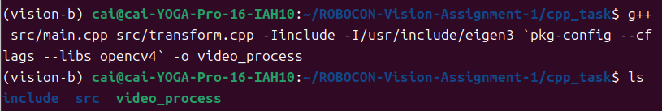
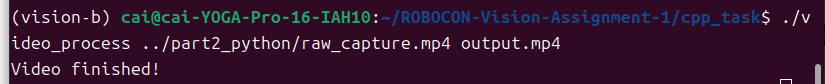

# Part5 — C++ g++手动编译OpenCV视频处理

## 实验目的
使用g++直接手写编译命令，完成多文件C++项目编译，读取视频，将画面转为灰度图并输出新视频。

## 项目目录结构
```
cpp_task
├── include
│   └── transform.hpp
├── src
│   ├── main.cpp
│   └── transform.cpp
└── README.md

## 完整编译命令
```bash
g++ src/main.cpp src/transform.cpp -Iinclude -I/usr/include/eigen3 `pkg-config --cflags --libs opencv4` -o video_process

## 运行程序
```bash
./video_process ../part2_python/raw_capture.mp4 output.mp4
```

## 实验截图

### 1. 编译成功截图


### 2. 程序运行完成截图


## 编译命令相关说明

### 1. `-I` 的作用是什么？
`-I`（大写i）用来**指定头文件的搜索目录**。
编译的时候，编译器除了系统默认头文件路径外，还会去 `-I` 后面给出的文件夹里面查找 `.h / .hpp` 头文件。
本项目 `-Iinclude` 就是告诉编译器，去当前目录下的 `include` 文件夹寻找自定义头文件 `transform.hpp`。

### 2. 为什么 transform.hpp 不单独作为一个 cpp？
`.hpp` 是**头文件**，一般只放函数声明、类定义、宏定义，**不写完整可编译的实现代码**；
函数具体实现写在 `.cpp` 文件（transform.cpp）。
头文件是用来给别的源文件`#include`引用的，不需要单独拿去g++编译。

### 3. 为什么只写 main.cpp 往往无法得到完整程序？
main.cpp里面调用了在`transform.cpp`中实现的函数。
如果只编译main.cpp，编译器找不到那些函数的具体实现，链接阶段就会报未定义引用的错误。
**所有包含函数实现的cpp源码，都必须一同参与编译**。

### 4. 编译成功后产生的文件是什么？
由命令最后的 `-o video_process` 指定，编译链接完成生成可执行程序：`video_process`。
这是二进制可执行文件，使用 `./video_process` 就可以运行。


# Part6 — CMake构建项目
> 在手工g++编译成功之后，使用CMake完成本视频处理项目的构建

## 1. CMakeLists.txt 的完整内容
```cmake
cmake_minimum_required(VERSION 3.10)
project(video_process)
set(CMAKE_CXX_STANDARD 17)
set(CMAKE_CXX_STANDARD_REQUIRED ON)

include_directories(include)
include_directories(/usr/include/eigen3)

find_package(OpenCV REQUIRED)

add_executable(video_process src/main.cpp src/transform.cpp)
target_link_libraries(video_process ${OpenCV_LIBS})
```
## 2. cmake configure 命令（配置）
```
cmake -S . -B build
```
## 3. cmake build 命令（编译构建）
```
cmake --build build
```
## 4. 可执行文件运行命令
```
./build/video_process ../part2_python/raw_capture.mp4 output_cmake.mp4
```
## 5.运行结果
执行程序后读取Part2录制的raw_capture.mp4原始视频，将视频转为灰度画面，处理完成终端输出 Video finished!，成功生成输出视频文件 output_cmake.mp4。


## 思考题：手工 g++ 命令和 CMake 的关系是什么？

CMake是构建系统生成工具，本身并不会直接编译代码；CMake读取CMakeLists.txt配置自动生成编译规则，底层最终调用g++编译器完成编译链接。手写g++是直接手动调用编译器，适合小型简单项目；CMake用来自动化管理项目头文件、第三方库依赖，适合规模更大的工程。
