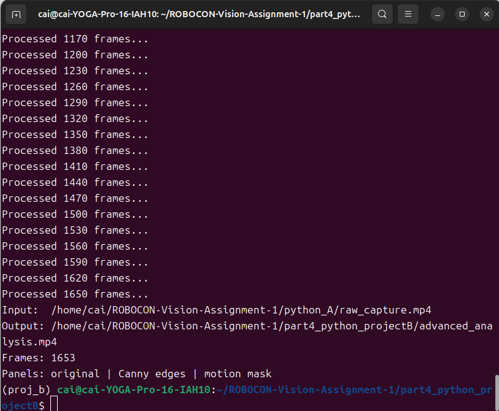
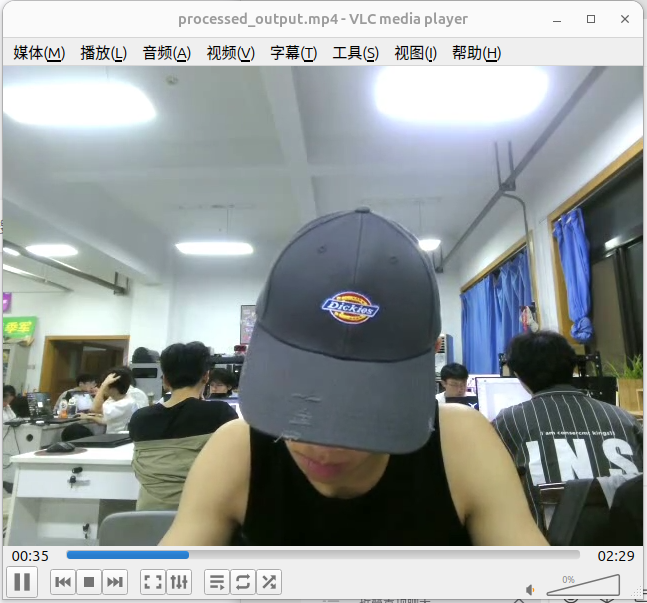

# Part IV Python Project B: 第二个 Conda 环境

## 实验目标
Project B 会读取 Project A 保存的原始视频，并进行进一步离线处理，最后输出另一个 MP4。
Project A 与 Project B 在元数据中声明了不兼容的 Python 版本范围。你需要分别部署并成功运行两个项目。


## 操作命令记录
```bash
# 1. 创建Project B环境
conda create -n vision-b python=3.13

# 2. 激活Project B环境
conda activate vision-b

# 3. 查看当前Python版本
python --version

# 4. 查看解释器路径
which python

# 5. 根据pyproject.toml自动安装全部依赖包
pip install .

# 6. 运行视频处理程序，读取part2目录的原始视频
python analyze_video.py ../part2_python/raw_capture.mp4 
```

## 环境信息说明
1. Project A 使用的 Conda 环境：vision
2. Project A Python 版本：3.10
3. Project B 使用的 Conda 环境：vision-b
4. Project B Python 版本：3.13

5. 为什么不能直接把两个项目当成同一个环境来完成？
两个项目在 pyproject.toml 中声明了互相冲突、不兼容的Python版本约束范围。
同一个conda环境只能安装单一版本的Python，无法同时满足两个项目各自要求的Python版本；
如果强行在一个环境里安装，升级或者降级Python之后，必然会破坏其中一个项目的依赖版本，导致另一个项目无法正常运行；
因此必须创建两套独立Conda隔离环境，各自匹配对应的Python与依赖包，互不干扰。



